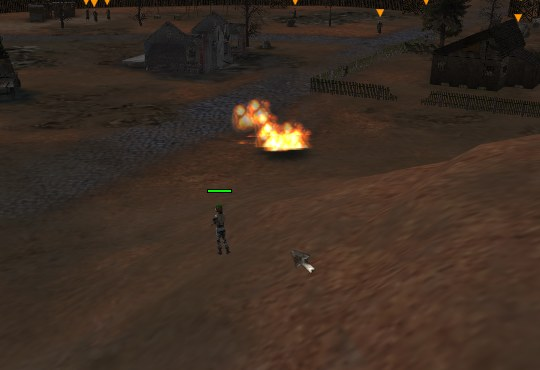
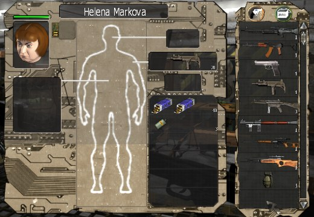
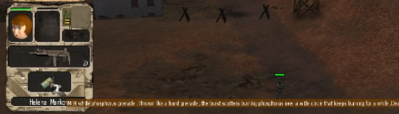

# The architecture of the game

A summary of how the game is put together inside. It grew gradually while
getting it running and fixing things, so it is written from the point of view of
"what you need to know if you want to reach into it". The details and the
procedures are in the topic documents it links to.

In the source paths the engine is called **y2k** and the project had the code
name **unborn** — the exe holds paths such as
`D:\Sebastian\oldPC\C\Dev\builds\unborn\y2k_source\` and the `.gui` files hold
the resource root `e:\Unborn_Resource\`.

---

## Rendering

DirectDraw7 and Direct3D7, not DirectX 8, even though it ships on the disc. The
code comes from `commonCode\DirectX7\App\`. At startup the game enumerates the
devices and writes the mode into the log:

```
Info: DD Device enumerated: 1, NVIDIA GeForce RTX 3080 Ti, whql: 0.
Info: Try to set display mode (2560 x 1360 x 32bpp x 0Hz).
```

The sound goes through DirectSound, the videos through Bink 1 (`binkw32.dll`)
plus a piece of DirectShow. Multiplayer uses plain WinSock, no DirectPlay.

### `dgVoodoo.conf` has the same keys in several sections

The configuration of the wrapper is not flat. `Antialiasing` exists separately
in `[Glide]` and in `[DirectX]`, `Filtering` only exists in `[DirectX]` (in
`[Glide]` it is called `TMUFiltering`) and `FullScreenMode` sits in `[General]`.
The game runs through DirectX, so the values from `[DirectX]` apply; whoever
looks a key up by name without regard to the section gets the Glide value, which
the wrapper never uses for this game.

Our settings: `Filtering = 16` (16× anisotropic filtering), `Antialiasing = 8x`,
`VRAM = 512`, `FullScreenMode = false` and `CaptureMouse = true` — in a window
the cursor is captured reliably, in fullscreen it escaped out of the sandbox.

---

## The archives and the precedence of loose files

The `*.ubn` files are **ordinary ZIP archives** (method 0, no compression). The
engine mounts nine of them and the list is hardcoded in the exe:

```
1.1.0.71-1.1.1.118.ubn   videos  textures  terrain
missions  sounds  objects  gui  data
```

The first one is the delta archive from the 1.1.2.178 patch — it carries
`.diff3D` files with which the patched engine overwrites the older content.

**Loose files next to the game take precedence over the archive.** Verified
twice: by the sound fix and by the magenta cross across a GUI panel. It is the
main lever for any modification — nothing has to be repacked.

---

## The family of containers

Most of the data files share a 16-byte magic GUID that differs only in the first
byte. The version and the record count follow it:

| first byte | extension | content |
|---|---|---|
| `0x37` | `.olb` | object library (units, characters, animals, rockets) |
| `0x38` | `.sav`, `.mis` | saved game and mission |
| `0x39` | `.gui` | the list of graphical resources of a screen |
| `0x40` | `.trs` | text resources |
| `0x41` | `.lay` | element layout |

The strings inside them have a one-byte length prefix. The parsers are in
`tools/trs.py` and in the samples in this document.

### `.trs` — texts

```
16 B  magic (0x40…)
u32   version (2)
u32   record count
        for each: u32 ordinal, str id, str German ("leer"), str text, str reserve
```

### `.lay` — layout

```
16 B  magic (0x41…)
u32   version (2)
u32   record count
        for each: u32 ordinal, str name, u32 id, u32 flag,
                  float x, float y, float width, float height
```

The coordinates are in a design space, not in screen pixels — the minimap is
134×134, the inventory 134×538, while on screen they are roughly three times
that size. So the engine maps the design space onto the screen with a
**constant scale** that it computes from the resolution and that appears nowhere
in the data.

Verified by experiment: doubling the width and height of the minimap in the
`.lay` made it twice as large in the game and it grew over the neighbouring
elements. So the coordinates are absolute, not relative to the extent of the
layout.

That has a consequence for attempts at a sharper interface: doubling the
coordinates and the images gives you **a UI twice as large at the same
quality**, because the area and its presentation grow by the same amount. It
would only be sharper if that scale could be reduced with the elements left in
place — and that would mean reaching into the exe, not into the data.

### `.gui` — the resources of a screen

```
16 B  magic (0x39…)
u32   version (2)
u32   ?
str   set id ("tGUIResourceID_Mission")
str   resource root ("e:\Unborn_Resource\")
u32   resource count
        for each: u32 id, str path, 4× u32 constants (4, 2, 4, 1)
```

**There are no dimensions here** — those four constants are the same for every
resource. So the size of the area comes from somewhere else, most likely from
the `.lay`.

---

## Textures and sheets

The key difference that decides what can be enlarged and what cannot:

- **3D models** reference a texture **proportionally** (UV 0–1). Enlarging the
  texture does not change the mapping, it only adds detail. That is why all 695
  object textures could be replaced with no further work.
- **The terrain and the GUI** use **pixel coordinates** into shared sheets.

For the terrain the coordinates are held by `terrain/details.txt`:

```
ID;Name;Category;File;left;top;right;bottom
16;…;standard/Asphaltstrasse.png;77;130;109;251
```

Those are not regular halves but hand-cut rectangles. The numbers look absolute,
but the engine divides them by a **fixed** sheet size, so they behave
proportionally: the sheet can be enlarged and the cuts fall into place on their
own, while recomputed coordinates overflow and reach into the neighbouring
piece. Verified in the game, the details and what follows from it are in
[upscale.md](upscale.md).

For the GUI it is different: there the engine stretches the image onto the area
declared in the resource, so the extra resolution is thrown away.

`terrain/displace/*.png` are not images but data for deforming the geometry; the
range is given by `displace.txt`.

---

## Settings and controls

Everything is in the registry under
`HKCU\Software\Silver Style Entertainment\Soldiers of Anarchy\Settings`. The
display, the detail levels, the volumes, the `CDKey` and the key assignments.

The keys have the form `AK<hex action id>_<slot>`, the values are virtual key
codes and `0xFFFFFFFF` means unassigned. Every action has two slots. **Watch out
for the hexadecimal id** — read as a decimal number the entries silently miss.
The complete table is in the main [README](../README.md).

---

### The graphics options in the registry

The labels of the `soa.exe -o` dialog lie in the exe as wide strings (from
`0x47C06A`), so it is visible from them what each value means.

**`TextureDetail` and `ObjectDetail`: zero is the maximum.** The hint in the
dialog reads *"You can decrease the texture resolution…"* — so the value is not
the index of an option but the **amount of reduction**. Zero means no reduction,
that is the highest quality. That matters for the enlarged textures: if zero
meant the lowest detail, the game would be shrinking them itself on load.

**The filters, on the other hand, are option indexes counted from one:**

| value | `TextureMagFilter` (Enlarge) | `TextureMinFilter` (Shrink) | `MipmapFilter` |
|---|---|---|---|
| 1 | Point | Point | **Off** |
| 2 | Linear | Linear | Point |
| 3 | — | — | Linear |

The default state of the package is 2, 2, 3, that is Linear everywhere. Turning
the mipmaps off in the game means setting `MipmapFilter` to **1**.

Mipmaps can be turned off in two places: here in the game and in
`dgVoodoo.conf` through the `Mipmapping` option. The package has the dgVoodoo
ones off, because most of the gain of the enlarged textures was being lost to
them; setting both is consistent, nothing contradicts anything.

---

## Diagnostics

The game writes `tracefile.log` next to the exe, with the categories
`TRACE_ERROR`, `TRACE_WARNING`, `TRACE_INFO`, `TRACE_NETWORK_BASE`. The exe also
holds categories named after the developers (`TRACE_SEBASTIAN`, `TRACE_RONNY`…)
that correspond to the cheats with the same names — see [cheats.md](cheats.md).

The log is the most valuable tool we have for this game. It revealed the missing
sounds, the format of the cheat arguments and the cause of the crash at startup:

```
Texture render method failed (render to texture with own zbuffer).
Error: ASSERT_HRESULT(0x887601C2)      = DDERR_SURFACELOST
Warning: Can't render to texture.
```

---

### The error codes

Everything the game reports as `ASSERT_HRESULT(0x…)` is an HRESULT. Facility
`0x007` is Win32 and `0x000` generic COM, `FormatMessage` translates both.
Facility `0x876` belongs to DirectDraw and Direct3D and there the low 16 bits
are the **decimal** number from the header — 450 is `DDERR_SURFACELOST`, 255 is
`DDERR_NOTFOUND`. [tools/decode_error.py](tools/decode_error.py) translates it
and can go through a whole log as well.

The message always carries the place in the original code too, so it is visible
where the error came from: `SoundObject.cpp(150)` is the sounds,
`tsStream.cpp(85)` opening files, `DXA_img_png.cpp(68)` loading images.

---

## Command line arguments

The switches are stored in the exe **in capital letters** in a single table at
`0x467250` (version 1.1.2.178), with the single-letter `o`/`O` a little past
them at `0x4672E8`. That is why they cannot be found by looking for strings
starting with a dash — the shortcuts in the installer do pass `-o` and
`-report`, but the parser evidently just cuts the dash off and compares
case-insensitively.

| argument | what it does |
|---|---|
| `o` / `O` | the graphics configuration dialog |
| `REPORT` | a system report; `MAPISendMail` and `MAPI32.DLL` are nearby, so it gets sent by mail |
| `UPDATE` | an update check |
| `RECORD` | records the course of the game |
| `REPLAY` | plays a recording back |
| `UIOFF` | turns the interface off |
| `HOST` | hosts a game over the network |
| `CONNECT` | connects to a given IP (it is validated, with the message `Target IP illegal`) |
| `TRACE_*` | turns a trace category on, 28 of them |
| `VR`, `VRASTGA` | unknown — they appear nowhere else in the exe |
| `xX` | apparently the character set for parsing a resolution such as `1024x768` |

### Tracing is turned on from here

Categories such as `TRACE_SKRIPT`, `TRACE_ROUTING`, `TRACE_INVENTORY`,
`TRACE_DMG_DEATH` or `TRACE_SEBASTIAN` are command line arguments, not an effect
of the developer cheats in the base as I originally assumed. The game prints at
the start of the log which of them are on. `TRACE_SKRIPT` is interesting for
work with the editor, `TRACE_ROUTING` and `TRACE_COMMANDO` for the AI behaviour.

### Replay is a deterministic recording

`RECORD` and `REPLAY` are not video but a recording of events per tick — the
code holds `CS_UI_DONT_RECORD`, `CS_NETWORK_DONT_RECORD`,
`CS_REPLAY_DONT_RECORD`, `RECORDING_UI`, the markers `TICK: %i`,
`INFO: BUILD v%d.%d.%d.%d` and the error message
`TRES_NETWORK_REPLAY_SYNC_ERROR`. The developers debugged multiplayer
desynchronisation with it. The `replay.log.gz` file the game writes next to the
exe belongs to the same system.

---

## The terrain

The ground surface stands on three lists in `terrain.ubn`. `base.txt` names the
base textures (`base/base_1.png` and on), `details.txt` addresses the details —
roads, tracks, grass variants — as hand-cut rectangles in shared 256×256 sheets:

```
ID;Name;Category;File;left;top;right;bottom
16;TRES_TERRAIN_TEXTUR_ASPHALTMITTE;...;standard\Asphaltstrasse.png;77;130;109;251
```

Those numbers look like absolute pixels, but the engine divides them by a
**fixed** sheet size, not by the real size of the loaded image. So they are
proportional: a sheet can be enlarged and the cuts fall into place on their own,
while recomputed coordinates overflow and reach into the neighbouring piece.
Verified in the game, the details are in [upscale.md](upscale.md).

`mappings.txt` holds the conversion tables between the sets, so the same mission
can be recoloured into a desert or into winter: `MAP 14 56` means that detail 14
of the standard set corresponds to detail 56 of the desert one. The fourth list,
`displace.txt`, belongs to `displace/*.png` — those are not images to look at
but data for deforming the geometry.

The code is in `source\landscape\`: `Y2K_LS_AreaDetails.cpp` loads `details.txt`
and `displace.txt`, `detail_mappings.cpp` processes `mappings.txt`.

### `TexGen.dat` has nothing to do with the textures

Despite the name it says nothing about sheets. It is readable text in `data.ubn`
(`data/UserData/TexGen.dat`) and it describes **the scattering of vegetation**
for the terrain generator in the editor —
`source\landscape\Y2K_LS_TerrainGenerator.cpp`:

```
BEGIN_GROUP
    NAME "Gruppe"
    DENSE 8.500000
    BEGIN_INFLUENCE
        ZONE_TYPE ZT_HEIGHT     FROM -20.000000  TO 149.500000
    END_INFLUENCE
    BEGIN_MEMBER
        ID 3   WEIGHT 40.000000   SIZE_MIN 1.100000   SIZE_MAX 1.400000
    END_MEMBER
END_GROUP
```

A group has a density, a list of members with a weight and a size range, and on
top of that the conditions `ZT_HEIGHT`, `ZT_ELEVATION` (slope) and
`ZT_DIRECTION` (compass direction), each with a ramp through `FROM_SMOOTH` and
`TO_SMOOTH`. With that you can say "scatter these two bushes on southern slopes
up to 150 metres". The format is open, so populating a map with vegetation can
be prepared by a script.

---

## The window: what decides it and what cannot be moved

The game is not a full screen application in the DirectDraw sense - it is a
window that covers the screen. Which window it is comes out of one byte of the
application object, the flag at `+0xC5`, written once and unconditionally at
`0x6269B8`:

| flag | style at CreateWindowEx (`0x628251`) | what it looks like |
|---|---|---|
| 1 | `WS_POPUP` + `WS_EX_APPWINDOW｜WS_EX_TOPMOST` | borderless, always on top, glued to 0,0 |
| 0 | `WS_OVERLAPPEDWINDOW` + `WS_EX_APPWINDOW` | title bar, resizable frame, ordinary window |

[tools/patch_exe.py](tools/patch_exe.py) flips it, and the launcher writes
it when the mode is picked. Two more things belong to the same story:

* **The game minimises itself whenever it loses focus.** The handler at
  `0x628520` calls `ShowWindow(SW_MINIMIZE)` on `WM_KILLFOCUS` and it is not
  guarded by the flag at all, so it happens in both modes. And it is not the
  only place: the deactivation branch of the same window procedure minimises a
  second time at `0x628647`, that one only when the flag says full screen -
  which is what drops the game into the taskbar the moment anything else is
  clicked, the console window of the launcher included. Both are skipped (the
  `jne` becomes a `jmp`, the `je` becomes a `nop` and a `jmp` of the same
  length) and both are written whatever the mode is; they belong to the window
  mode as little as the log sharing does.
* **The size of the window cannot be fixed the same way.** The game only
  resizes its window in the full screen path (`0x6282C5`), and the rectangle it
  applies there does not come from the display mode: a few lines earlier the
  same function fills it from `MonitorFromWindow` + `GetMonitorInfo`. Letting
  that block run in a window was tried and it made the window cover the whole
  monitor.

So a window keeps the size the game created it with, which is not the chosen
resolution. What the resolution still decides is what the game renders;
dgVoodoo scales that into the window. Forcing `Resolution` in the `[DirectX]`
section of `dgVoodoo.conf` was tried as well: it does change what is rendered,
and the picture is right, but the window keeps its size. The remaining ways
would be to resize the window from outside after the game starts, or to make
that resize block use the display mode instead of the monitor - which needs a
code cave, not a byte.

`CaptureMouse` in `dgVoodoo.conf` is a separate thing: while it is true the
cursor stays inside the game window whatever shape the window has.

### The log keeps itself to itself

The game opens `tracefile.log` with `CreateFileA(..., dwShareMode = 0, ...)` at
`0x651DCF`, so while it runs nothing else can open the file - the share mode is
decided by whoever opens first, and asking politely from the other side changes
nothing. Pushing 1 (`FILE_SHARE_READ`) instead is the third patch in
[tools/patch_exe.py](tools/patch_exe.py); the game only ever writes, so it does
not notice. The launcher applies it whatever window mode is picked, which is
what lets its console window follow the log while the game is running.

---

## The keys, and the screenshot nobody knew about

The key bindings live in the registry under
`HKCU\Software\Silver Style Entertainment\Soldiers of Anarchy\Settings` as
`AK<id>_1` and `AK<id>_2`, two keys per action. **The number is hexadecimal**
and it is the action's id, not its position in any list - the format string is
`AK%X_1` at `0x866C98`. That is easy to get wrong: `AK30_1` is not the
thirty-first action, it is id 0x30.

The table it comes from is at `0x865820`, 67 records of sixteen bytes:

    { DWORD id, char *name, DWORD key1, DWORD key2 }

The ids are the game's own message numbers, which is why `AK_SAVE` is 0x424 and
`AK_LOAD` is 0x425 - the same two the mission object dispatches for quick save
and quick load. The alignment is worth pinning against those two: read the
record one dword out and everything still looks plausible while being wrong.

The 67 records, with the names the game's own key help gives them
(`TRES_ACTIONS.trs`, keyed by the `AK_` name), are generated into the
launcher by [tools/gen_keys_cs.py](tools/gen_keys_cs.py), and the launcher's
**Keys** window edits them: click a key, press the one wanted, and the value
is written into the registry there and then. A key is a virtual-key code; a
mouse button is `0x80000000` plus its number - 0 left, 1 right, 2 middle, 3
wheel down, 4 wheel up - which is what the five actions whose default equals
their own id (`AK_SELECT`, `AK_CONTEXT`, `AK_FREELOOK`, `AK_CAMERA_DOWN`,
`AK_CAMERA_UP`) are bound to; `0xFFFFFFFF` is no key. The game reads the
keys when it starts and writes its own back when it exits, so the window
locks while `soa.exe` runs. A key bound twice is shown in red - the game
does not mind, it answers both.

**`AK_SCREENSHOT` is id 0x7B and its default key is F12**, bound in the shipped
settings and in the registry. The game writes `shot%04d.png` into its working
directory - the `Game` folder when the launcher starts it - counting up from
`shot0000.png`, so nothing is ever overwritten. It is the only way to take a
picture of the game without leaving it, which full screen does not forgive.

## The fonts come from Windows, by name

The game draws no font of its own. Two names are in the exe, and every letter
on screen goes back to one of them:

* **"Tahoma"** at `0x868060`, which `Y2KApp.cpp` (0x6DA370) asks `CreateFontA`
  for **nine times in nine sizes** - weight 400, quality 2, `FF_MODERN` - one
  after another at startup. That is the whole interface: the menus, the
  trader, the equipment screen, the panels, the tooltips, the briefings.
* **"Arial"** at `0x8611AC`, which `bmfont.cpp` (0x6310B0) asks for once, at
  16 pixels, as the default font of the routine that turns a Windows font
  into a texture of glyphs. The nine Tahomas go through that same routine -
  `0x631670`, called right after each `CreateFontA` - so the game never
  draws through GDI at all: it measures with `GetCharacterPlacementA` and
  `GetTextExtentPoint32A`, bakes once, and draws quads. Where the Arial
  default itself reaches the screen was not found; it is set for
  completeness.

Because the layout is measured from the font the game was given, another
font simply works: with "Stencil" written over "Tahoma" the Options screen
laid its columns out right, the unit panel fitted its name, the tooltips
their word. One thing to look at with a chosen font: the briefing on the
loading screen has a fixed line spacing, and a taller face overlaps its
lines there.

Each name is a plain string in `.data` and the calls only push its address,
so the patch is the pointer, not the string: the shipped string has seven
bytes of room, and a face name may have 31 (`LF_FACESIZE`), so a new name is
written into the zero padding at the end of `.text` - `0x7B4E00` for the
screens, `0x7B4E20` for the other - and the nine (or one) `push` operands are
pointed at it. The shipped name puts the pushes back and the padding to zero,
so the default is the file as it came, byte for byte, and `check.py`'s round
trip covers it. `patch_exe.py --font NAME`, `--bitmap-font NAME`,
`--default-fonts`; the launcher's Patches window has the two as drop-downs of
the fonts the machine has, each name drawn in its own face, and a name can
be typed. A name Windows does not have is answered by the font mapper with
whatever it thinks closest, so a wrong name costs nothing but the look.

The font has to be on the machine. A package that wants a font of its own
would carry the TTF and have the launcher register it for the game's process
(`AddFontResourceEx` with `FR_PRIVATE`, before `soa.exe` starts - or in the
game, since the fonts are made at startup); that is not built.

## The command console: it exists, and it cannot be opened

The exe builds a whole tree of typed commands at startup, rooted in a node
described as "application object", and answers an unknown one with
`unknown command; try Help()`. Everything is there - names, one-line
descriptions and named parameters:

| command | what it does | parameters |
|---|---|---|
| `Help` | displays help | `string subject` |
| `Quit` | quits application | |
| `ScreenShot` | takes a screen shot | writes `shot%04d.png` |
| `AirStrike` | order air strike | |
| `ObjectMgr.Load` | loads an object | `string fileName` |
| `ObjectMgr.Display` | displays a loaded object | `int ID` |
| `Landscape.LoadHeightMap` | loads a height map from a bitmap | `filename, minHeight, maxHeight` |
| `Landscape.SaveHeightMap` | saves the height map into a bitmap | `filename, minHeight, maxHeight` |
| `Landscape.ShowPathMap` | shows/hides the path map | `int unitSizeX, int unitSizeY` |
| `Landscape.ShowVisMap` | shows/hides the visibility map | `int iX, int iY, int enable` |
| `Landscape.ShowKIMap` | shows/hides the AI map | `int generalID` |
| `Landscape.ShowStructures`, `ShowAir`, `ShowParty`, `ShowObjectSize`, `ShowPath`, `ShowGround`, `ShowSmoke` | debug overlays | `int enable` |
| `EventRecorder` / `Replay` | records or plays back events | |
| `Replay.Jump` | jumps forward to a time | `Time` as `hh:mm:ss.msms` |
| `Replay.SpeedFactor` | speeds the replay up or slows it down | 0.5 = half, 2.0 = double |
| `Replay.ShowActTime`, `AbortReplay`, `AbortUIReplay` | | |

**But nothing in the shipped build opens a line to type them into.** Four
things say so:

* the input table has 67 actions (`TRES_ACTIONS.trs`) and none of them is a
  console; keys can only be bound to those actions
* neither `gui.ubn` nor `data.ubn` holds a layout for a console
* the exe imports no `AllocConsole` and no `WriteConsole`, so there is no
  Windows console either
* the command parser is called only from inside its own module - no path leads
  to it from the input handling

So the console was a developer tool that the release build registers but never
shows. What did survive is the way in through other doors: `ScreenShot` has its
own action (`AK_SCREENSHOT`), `RECORD` and `REPLAY` are command line switches,
and the editor's File menu carries *Imp. Height Data*, *Exp. Height Data* and
*Import Objects* - the same three operations as `LoadHeightMap`,
`SaveHeightMap` and `ObjectMgr.Load`. The debug overlays had no other door -
until it turned out they need no door at all, see below.

### How a command is put together

Each group of commands is one function that both describes itself and does the
work. `Landscape` is `0x6D5E50`: called one way it writes the names and the
help texts into the tree, called another way it takes the number of the command
and runs a `switch` (the jump table is at `0x6D8378`). The registration writes
the name at `-0x38` of the record, the number at `-0x28` and the description at
`-0x24`, which is where this list comes from:

| # | command | # | command |
|---|---|---|---|
| 0 | `ShowStructures` | 6 | `ShowVisMap` |
| 1 | `ShowAir` | 7 | `ShowPath` |
| 2 | `ShowParty` | 8 | `ShowGround` |
| 3 | `ShowObjectSize` | 9 | `ShowPathMap` |
| 4 | `ShowKIMap` | 10 | `LoadHeightMap` |
| 5 | `SaveHeightMap` | 11 | `ShowSmoke` |

### The height map can be exported without the editor

Two of the Landscape commands do real work rather than flip a flag, and one of
them turns out to be as easy to call from outside as the cheats are.

`SaveHeightMap` is case 5, and its case body is short (`0x6D7F74`):

    006D7F84  fild [ecx+0x34]  / push   ; maxHeight, as a float
    006D7F8B  fild [ecx+0x1C]  / push   ; minHeight, as a float
    006D7F8F  mov  ecx, [0x880F98]      ; the world
    006D7F98  push eax                  ; the file name
    006D7F99  call 0x6878A0

So it is a thiscall on the world taking `(char *filename, float minHeight,
float maxHeight)` and returning an int that is negative on failure. The file
name is a **plain char pointer**, not a tsString, which makes it easier than
anything else called from outside so far.

What `0x6878A0` does is worth knowing before using it. It asks the renderer to
stop (`[world+0x48]`, `0x662970`), builds a 32-bit off-screen surface of
`[world+0x18]` by `[world+0x1C]` with the masks `00FF0000 / 0000FF00 /
000000FF`, walks the height grid writing each height scaled between the two
bounds into all three channels at once - so the picture is grey - hands the
surface to the application's picture writer (`0x621530` on `[0x875B1C]`), and
starts the renderer again. The exe carries libpng, so the format follows the
name.

`LoadHeightMap`, case 10 at `0x6D82A7`, is not as simple: the argument to
`0x687660` is an object built by `0x47BFA0` out of the parsed parameters, so
calling it means building that object too. The editor's *Imp. Height Data* does
the same job through its own panel, which is the easier door.

### Whether the replay system is there is a runtime question

`EventRecorder` and `Replay` answer `no replay system available` when the
global at `0x874AE0` is null (`0x6D4BC1`). That global is read elsewhere as
well - the state switch in `Y2KApp.cpp` asks it something at `0x6D351C` - so it
is not obviously absent from the release build, and whether a shipped game has
one is a single dword read away while the game runs. Nobody has looked.

### The air strike is a shipped feature; the console command was its test

`AirStrike` is the eighth command in the top group and its own source file is
`scripts\AirStrike.cpp`. The console case (`0x6D48AD`) reads as follows once
the callees are named - the first reading of it took the wrong function for
the launch:

    construct a flight object       0x6B8D20   (only a vtable, 0x7D2D28; the object is 4 bytes)
    insert waypoint (100, 100, 2.0) 0x6AF670   vector<xyz>::insert(end, 1, value)
    insert waypoint (150, 150, 0.0) 0x6AF670
    launch                          0x6B9030   (this, &vector) -> int, 0 = flew, 1 = no plane, <0 = error
    destroy the vector              0x6A0940   (a `ret 8` - the element type is plain floats)
    free its storage                0x756600
    destroy the flight object       0x6B8D50

**The two waypoints are hard-coded** - `0x42C80000` is 100.0, `0x43160000` is
150.0 - so the developer command flew a fixed diagonal. But the launch behind
it is not a test at all.

What `0x6B9030` does:

* takes the **bunker** (`[0x8759C0]`, a `Y2KBunker` of 0xE8 bytes, created in
  `0x51ABD0`) and its unit list at `+0xD8` (a `vector<Y2KKIBasicPartyObject*>`;
  the hangar and workshop panels iterate the same vector). Null bunker or an
  empty waypoint list is `E_FAIL`.
* keeps the units whose category at `+0xC` is zero - the aeroplanes - and
  which have a weapon
  with ammunition left (`0x586E90` counts the weapons, `0x5870C0` fetches one,
  its `+0xF4` is the magazine and vtable `+0x30` on that says how much is in
  it). No such unit: returns 1 and nothing happens.
* for each waypoint, round-robin over the candidates, calls
  `0x6B9390(this, &xyz, plane, isLast)` - the one function in `AirStrike.cpp`.
  It erases the plane from the bunker list, re-initialises it (vtable `+0xBC`,
  `0x57C100`, `+0xC4`, `+0x2C`), registers it with the world
  (`0x687DF0(world, [plane+0xB0])`), writes the waypoint into the plane's
  position at `+0x54..+0x5C`, and builds a 0x60-byte order with
  `0x743FC0(plane, 0x88, isLast, xyz)` from `Y2KKIUnitAirplane.cpp`, which
  goes in through vtable `+0x100` and `0x6A5450` (`SkriptList.cpp`).
* when the plane's animation script ends
  (`CY2KKIUnitAirplaneScript_Animation::OnEnd`, `0x744470`) the plane is taken
  out of the world and pushed back into the bunker list - it lands again.

**The game calls this itself.** `0x6B9030` has exactly one other caller,
`0x5DC610` in `Y2KKIUIPlayer.cpp`, and that is button 5 of the mission context
menu (`MissionKontextMenu.cpp`, jump table `0x4CCD28`, ids counted from one):
the fifth button of `LAY_MISSION_KONTEXTMENUE.lay` is
`LAY_MISSION_KONTEXTMENUE_BUTTON_LUFTSCHLAG`, its text
`TRES_GM_MAIN_BUTTON_LUFTSCHLAG` is *Air Strike*, and the MiG-27's own
description says *the 5 pylons can be loaded with 500lb and 1,000lb bombs*.
The player's version first asks `0x6B8D60` whether a plane with ammunition is
in the bunker at all, then collects the waypoints from the mission: every
object of type `0x7F9` (`Y2KKIEvent`) in the player's object list
(`[0x875A60]+0x6C`) whose script (`+0x178`) is flagged (`0x6A77A0`, byte
`+0x2C`) and belongs to this player (`0x6A7710`, `+0x28`, compared with
`[player+0x20]`) gives its position, is unflagged and removed from the world.

**Why the button never shows.** The menu is filled by the selected units: the
context menu (`0x4CB9E0`) asks each one through vtable `+0x38`, and the
answers are merged by `0x4CBC20` into a list of button indices counted from
zero. `Y2KKIChar`'s answer (`0x6F7BA0`) adds index 4 - the air strike - only
when the click was on open ground **and** `0x583B50` says the mission holds a
flagged `Y2KKIEvent` for the player's party. Those markers are the mission
designer's to place, and a mission without them has no air strike, however
many MiGs sit in the hangar. (Index 5, *speech*, is what a click on a vehicle
made approachable by `SetApproachableMode` - byte `+0x238` - adds; the two are
easy to confuse.)

**Or the button itself, in every mission** (`patch_exe.py --airstrike-menu`,
in the launcher's Patches window). Four small patches make the game's own
button do what the map window does, radio and marker included:

* `0x583B50`, the question both `KIChar` (`0x6F83F4`) and `KIUnit`
  (`0x71C9AC`) ask before offering the button - *is there a flagged marker
  for this party* - becomes a jump to `0x6B8D60`, *is there a plane with
  bombs in the bunker*. It reads only the bunker global, so the unit in
  `ecx` does not matter, and it returns the same way.
* the button's case (`0x4CC3DB`) first copies the click's world point, which
  the menu keeps at `+0x148`/`+0x14C`, into twelve bytes of the `.text`
  padding (`0x7B4980`, z = 0 - what the injection tool uses too).
* the launch (`0x5DC771`): an empty waypoint list gets that point inserted
  with the vector's own `insert` (`0x6AF670`, at the end, one element) - a
  mission with markers of its own still bombs the markers - and when the
  launch answers 0, a **red ping** goes on the minimap at the point and a
  **radio call** plays.
* when the flight is over (`0x744470`, the airplane script's `OnEnd`, which
  also puts the plane back into the bunker list) the ping is taken off.

The ping is the scripting system's own `StartPing`: `0x5F1170(x, y, colour,
id)` on the mission object - `[0x875AA4]`, which is where the event reads
it, and which makes the launcher's heap scan for the mission unnecessary -
puts a 0x20-byte record into the minimap's vector at `[mission+0x240]+0x80`
(`+4` x, `+8` y, `+0xC` colour as `0x00RRGGBB`, `+0x10` a clock, `+0x14`
1500 ms between rings, `+0x1C` the id), and the minimap sends a ring out
from the point every one and a half seconds until `StopPing`
(`0x5F11D0(id)`) removes the record. The missions' own pings are green
(`0x0000FF00`); ours is red, id `0x4A11`.

The radio is `Play2DSound`'s call: `0x6A6D80(tsString name, 0)` on the
sound object `[0x880FAC]`, which looks the bare name up in eleven fixed
folders (`sounds\ingame\units\` ... `\misc\`, `\music\`, and the mission's
own) - and only among the names the archive directory knows: a loose file
replacing an entry works, a new loose file does not (`E_FAIL`, "Sound not
found. ''"). So the three clips go **into `sounds.ubn`** under
`sounds/InGame/misc/`, appended by [tools/add_sounds.py](tools/add_sounds.py)
at build time - by hand, not with Python's `zipfile`, which rewrites the
central directory and turns the five `SchussTreffer_Körper` names into
UTF-8. The cave keeps `radio_airstrike_a.wav` in the padding and rotates
the letter, so the three calls take turns.

The ring menu opens on a held right button on open ground; the jet is at
the top right of the ring (the ring moves to stay on the screen near an
edge), and letting go on it sends the MiG. Verified live: the plane leaves
the bunker list the same moment, the point in the padding reads what the
unprojection says for the click, the rings run for the thirty seconds the
plane is out and stop as it lands, and the log shows the clip found. Two
things learned the expensive way: a strike within twenty-five units of the
squad ends the mission (the bomb does not care whose it is), and in follow
mode every click near the squad is near the squad.

**So the injection is the way for a program, and it is verified.**
[tools/airstrike_inject.py](tools/airstrike_inject.py) does what the console
case did with points of its own: builds the vector on the thread's stack,
constructs the 4-byte strike object, inserts the points, calls `0x6B9030`,
frees the vector. With a MiG-27 (`vehicle(2)`) and bombs on its pylons in the
hangar, `--at X,Y` sends the plane, the bomb lands on the point and a unit
standing there dies - three strikes in one session, no crash, the launch
answering 0 each time and the plane back in the bunker list a few seconds
later with one pylon's magazine gone. Without a plane it answers 1 and nothing
happens. The plane's own record shows the flight: its position at `+0x54`
becomes the target and the first pylon's magazine at `[weapon+0xF4]` turns
null.

The launcher carries the same call (`GameLink.AirStrike`): `airstrike(x, y)`
in the console, and in the map window an *Air strike* button that arms the
next click - one click, one bomb, then it disarms itself, and Esc puts it away.
The map marks the target with a ring and a cross for the 45 seconds or so the
plane is out, and a radio call plays: the game has no chatter of its own, so
[tools/radio_clip.py](tools/radio_clip.py) makes one from the Windows voices
through a radio's narrow band - three exchanges, recorded with ElevenLabs,
and the build packs them into `Play.exe` as `SoA.Radio.a`, `.b`, `.c`; the
launcher plays one at random, never the same twice running (a kit without
the files is just quiet).

Two things worth knowing when aiming:

* Positions are the two floats at `+0x54`/`+0x58` of a unit, in world units on
  a map of `[world+0x24]` by `[world+0x28]`. The player's own squad is the
  pointer array at `[UIPlayer+0x78]`, and the `UIPlayer` is `[[0x875A84]+0x18]`
  - the lists at `[0x875A60]+0x6C` and `+0x88` can hold another party's units,
  so a position read from there may not be the player's.
* The bunker's unit list keeps its category at `+0xC`: 0 is an aeroplane
  (MiG-27, F-15), 1 a helicopter, the rest ground vehicles; the hangar panels
  show 0 and 1, the workshop the others, and the strike keeps only 0.

### The camera: two limits in a constructor, and why the wheel slid

The mission camera is one `Y2KCamera` (vtable `0x7D3270`, its pointer in the
global `0x8838E8`), built in `Y2KApp.cpp` at `0x6DC6E0`, and that constructor
is where the zoom range lives: the height it may fly between is written as
two immediates, `+0x5C = 2.0` and `+0x60 = 30.0`, with the clamp switched on
at `+0x70`. The wheel does not go through any of the camera's own dolly
functions (the `AirStrike`-style hooks that counted calls found none of them
moving); the mission (`Y2KMission.cpp`) hands the event to the camera's input
handler (vtable `+0x18`, `0x6DD770`), which moves the position along the view
direction at `+0x24..+0x2C`, all three axes. The clamp (`0x6E0720`, called
from Tick every frame) then puts only z back, so x and y keep the step and the
camera slides across the map at either limit.

`patch_exe.py --camera` sets the limits to 1.5 and 150 and routes both clamp
branches through a few bytes in the zero padding at the end of `.text`
(`0x7B45D0`) that first pull x and y back along the view direction by the same
amount they pull z. The docstring of [tools/patch_exe.py](tools/patch_exe.py)
has the listing. Finding all this took an afternoon of reading the wrong
functions: `0x6DFE80` clamps a value at `+0x30` between 5 and 50 and looked
like the zoom, but it is the free camera's, called every frame with zero.

There is no key to move the camera faster - the speed of every motion is set
where the motions are made (`0x6DCA1F`, 0.025 world units a millisecond for
panning) and the input table has none. `patch_exe.py --fast-camera` adds one:
where the camera loads the frame time to apply its motions (`0x6E062D`) a
detour asks `GetKeyState(VK_SHIFT)` and multiplies the time by five while the
key is down. The keys in the action table are Windows virtual-key codes
(`AK_SELECTMODIFIER` is `VK_CONTROL`, `AK_COMMANDOSTACK` is `VK_SHIFT`), so the
game hears its keys through Windows messages and `GetKeyState` sees them.

Since launcher 1.20.1 every patch that is not the window shape or the intro -
focus, the log, the camera, Shift, the character set - has a box of its own
behind the *Patches* button, with what it does written next to it. The
launcher carries the same signatures as `patch_exe.py`
([tools/launcher/Patches.cs](tools/launcher/Patches.cs)) and writes the exe
the moment a box is ticked, refusing while the game runs. Below the boxes
sit the two fonts (see "The fonts come from Windows, by name"), the one
setting there that is a name rather than a switch.

### Pause and give orders: the "turn-based patch" that never shipped

The readme of 1.0 mentions a separate download, *a patch to allow turn-based
play - pause in single player and issue orders*. It never reached 1.1.2.178:
the pause key (`AK_PAUSE`, 0x419, bound to P in the settings) puts the mission
into state 0xD, the modal `MissionBreakPanel`, which swallows every click but
the one that closes it.

`patch_exe.py --active-pause` builds it the other way round. The mission's
Tick (`0x5E9650`) hands the frame time to everything in turn - the landscape,
the interface, the object manager, the rockets, the weather, the camera, the
minimap, the message list, its own timers. A byte in the `.text` padding
(`0x7B4680`, the section made writable for it) says whether the game is
paused; where the Tick loads the time, a detour keeps the real value beside
the byte and zeroes the register while it is set. Detours of their own give
the real time back to the interface, the camera, the minimap, the message
list - and to the player library inside the object manager's tick
(`0x5A7DE3`, `Y2KKIPlayerLibrary`), which is where selection, the context menu
and the path preview live; without that one the game froze properly but no
menu opened. The pause key's single-player branch flips the byte instead of
opening the panel; multiplayer keeps its own pause. Verified live: units are
selected and ordered while everything stands, and move when time resumes.

### A program at the controls

With the pieces above a program can play, slowly: it reads the squad out of
the UIPlayer (`[[0x875A84]+0x18]+0x78`), each unit's position at `+0x54` and
the point it walks to at `+0x304`, photographs the screen (a GDI grab of the window) when it needs to look, and gives orders through the
mailbox below. The first version clicked in the window instead (`mouse_event`:
a left click selects, a right click on the ground sends the selected unit
there) and measured the screen-to-world map from three arrivals; that worked
to the unit but had to be measured again after every scroll.

**What a right click does**, read off the UIPlayer's handler (`0x5DC7B0`): it
asks `0x5DB0E0` what is under the mouse - objects through the landscape's
`0x686640`, and if nothing, the terrain through `0x686A90` - and hands the
first hit's world x and y to `0x5DAC80(this, x, y, released, mode, queue,
flag)`, the order at a point. The terrain pick answers only near the centre
of the screen when called from outside (its cell walk gives up on most rays;
the game rarely needs it, since a click on open ground still hits the ground
objects), so the projection is taken from the source instead: the view and
projection matrices the game hands Direct3D, `GetTransform(2)` and `(3)` on
the device at `[0x875B14]`. Unprojecting a screen point with them and cutting
the ray with the ground plane matches the game's own pick at the centre to
two decimals, and answers everywhere.

**The mailbox** (`patch_exe.py --mailbox`) is how those calls are made
safely: a request written into the padding of `.text` (`0x7B4750`: 1 = pick,
2 = order at a world point, 3 = the two matrices) is served by a detour right
after the mission has let the camera render (`0x5E93A1`), on the game's own
thread - a foreign thread caught the matrices mid-frame and the pick answered
once in nine tries. [tools/ui_inject.py](tools/ui_inject.py) writes the
requests, [tools/play_bot.py](tools/play_bot.py) uses them: `--goto 400,850`
sent the selected unit to (400.0, 850.0) exactly, with no mouse, no window and
no focus involved.

**Every other order is a virtual call on the unit** - one slot per
`Commando_*` method of `CY2KKIBasicPartyObject`. The first reading of this
table came from the context menu's button cases (`MissionKontextMenu.cpp`, the
switch at `0x4CC6C5`) and named the slots by the buttons' order, which was
wrong: `+0x384` is not *attack* but *throw the secondary weapon*, and the
soldier who "set off with his weapon up" had been told to throw a grenade at
the point. What settled it was the game's own trace: the mask at `0x861288`
ORed with `0x40` makes every command log itself by name
(`CY2KKIBasicPartyObject::Commando_ThrowSecondaryWeapon ID: 20055
CommandoSource: CS_UI`), and each of those trace strings is referenced from
exactly one function, which sits in exactly one slot of the `KIChar` vtable
`0x7D66F4`:

| order | slot | arguments |
|---|---|---|
| MoveTo | `+0x358` | `(x, y, mode, flag, source, queue)` - mode 3 is what a right click passes |
| Attack Target | `+0x328` | `(object, flag, source, queue)` |
| Attack Ground | `+0x324` | `(x, y, flag, source, queue)` |
| StopMove / Wait | `+0x370` / `+0x374` | `(source, queue)` |
| Kneel / LieDown / StandUp | `+0x378` / `+0x37C` / `+0x380` | `(source, queue)` |
| GetIn / GetOut | `+0x344` / `+0x348` | `(object, source, queue)` / `(0, source, queue)` |
| ThrowSecondaryWeapon | `+0x384` | `({target, x, y, 0, valid} by value, flag, source, queue)` |
| ThrowSmoke | `+0x30C` | `(x, y, source, queue)` |
| Reload | `+0x3A0` | `(source, queue)` |
| UseEquipment (heal) | `+0x38C` | `(item, patient, source, queue)`, the medikit from `0x5860E0(unit, 0x80)` |
| Approach `+0x320`, Patrol `+0x35C`, LootArea `+0x354`, PickUp `+0x360`, Prepare `+0x364`, PutDown `+0x368`, Exchange `+0x36C`, Escape `+0x33C`, Climb `+0x338`, Use `+0x398`, PlaceBomb `+0x31C`, StartBomb `+0x390`, CancelBomb `+0x394`, PlaceTransmitter `+0x39C`, Activate `+0x318`, Land `+0x350`, AllGetOut `+0x388`, UseFlamer `+0x310`, ChangeKIMode `+0x32C`, ChangeEquipment `+0x330`, ChangeInventory `+0x334` | | not tried |

The source is 6 for `CS_UI`, the player; the queue flag is whether the order
waits behind the current one (Shift held). Every one of them builds a
command object (`0x5CA5F0`), stamps it with those two and hands it to
`+0x2E8` (`0x580B40`), which drops it for a dead unit (`+0x17C` above zero),
records it when the event recorder is on, sends it over the network in a
network game, and otherwise executes it at once through `+0x204`
(`0x580F00`). The unit remembers what it is doing at `+0x178`, the command's
action number: 17 waiting, 10 moving, 7 kneeling, 2 attacking.

Two things an attack will not do: reach a target the unit cannot see (the
command is taken, the action reads 2, and the soldier stands where he is -
what a right click on the fog cannot do either), and walk to a goal the path
finder cannot reach (a `MoveTo` into the enemy camp from 350 units away is
simply not walked; a leg that ends on open ground is). And one thing that
takes the game down: an *Attack Target* with a unit address from a previous
game - the object lists are rebuilt on every load, so addresses are only good
for the mission they were read in.

The mailbox's fourth request makes any such call: the object, the vtable
offset, up to twelve arguments; [tools/play_bot.py](tools/play_bot.py) wraps
the ones a plan needs (`move`, `attack`, `attack_ground`, `kneel`, ...).

**Who is who in a mission.** `KIMission` at `[0x875A58]` keeps the
`PlayerLibrary` at `+0x2C`, whose vector at `+0x20` holds every player - the
`UIPlayer` (vtable `0x7CFE38`) and the AI players (`0x7CC3E4`) alike. A player
has its number at `+0x20` (the party the map cells carry is that plus two),
its units in the vector at `+0x78..+0x7C` (the dead are taken out of it), and
its **diplomacy** as a `std::map<int, int>` at `+0x90`, player number to 0
neutral, 1 enemy, 2 friend - the order the editor's `SetDiplomacy` names are
matched in (`0x5578E4`); the scripted event sets it through `0x5C3680`. A
player missing from the map is neutral. Read the other way round (0 enemy, 1
friend, the natural guess from the first dump) it cost a squad: the "friends"
at the monastery had a tank.

A unit's **health** is at `+0xD0` (the most) and `+0xD4` (what is left), its
armour at `+0xD8`/`+0xDC` (100/2500 on a tank, 0 on a soldier) - read off
`ApplyDamage` (`0x57C950`), which goes through the virtual getters and
setters `+0x7C`/`+0x84`/`+0xA8`/`+0xB0`/`+0xA4`/`+0xB4`; a `KIChar` adds the
bonus of its `Y2KRPG_Character` at `+0x320` (rank at `+0x8`, experience at
`+0xC`) on top. Its owner is at `+0x198`; a unit inside a vehicle stands at
(-1e7, -1e7).

**The first plan** (`play_bot.py --hunt`) is built on that: the squad runs
in legs of a hundred units towards the nearest enemy soldier, tells everybody
to attack him once he is within reach, and moves on to the next one when he
is gone. The first version took the nearest enemy of any kind and lost the
whole squad to a tank in the monastery courtyard - rifles do nothing to
armour, so now a vehicle is never a target and a soldier standing within
eighty units of one is left alone. That is the state of the art of this
program's generalship; what it needs next is cover, the squad's own vehicles,
and a reason to be anywhere.

**Mission cheats from outside.** [tools/mission_cheat.py](tools/mission_cheat.py)
does what the launcher's console does: finds the mission object in the heap
(vtables `0x7D0568` and `0x7D0564` at `+8`) and calls the handler
`0x5ECA70` with the line. `endlessmunition` and `immortalone` are *toggles* -
cases 2 and 3 of the handler's switch (`0x5EE200`) flip the bytes at
`0x875AA0` and `0x875A30`, which outlive the mission - so the tool reads the
byte and only calls when it has to flip; a second blind call had turned the
ammunition off again for a whole test.

**Two ways to crash the game from outside**, both found the hard way: the
stale unit address above, and the game's own screenshot call (`0x6031B0`) on
a thread of our own while a menu or a dialog is up - DirectDraw
`0x887602F8`, twice. Screenshots are now taken from outside (a GDI grab of
the client rectangle), and [tools/menu_bot.py](tools/menu_bot.py) drives the
menus on those: it waits for the screen to change instead of sleeping, and
`--reload N` loads a save from inside a mission (Esc, Load, the row, OK).
Faster still is no menu at all: `mission_cheat.py --load BombTest.sav` hands
the save's full path to `0x5F2C10`, the method quick load calls with
`QuickSave.sav` (what the launcher's `GameLink.LoadSave` does), and the
mission is back in twenty-five seconds instead of fifty; a bunker save lands
on the team screen, where two clicks (Automatic, Start Mission) remain. Only
the first mission of a session still needs the main menu.

### The overlays need no command tree

The cases turned out to be almost nothing. Every overlay builds an object that
is a vtable and no more, hangs it on the renderer and turns the drawing on:

    push 4 / call operator new / mov [obj], 0x7C8820   <- ShowStructures
    mov [renderer+0xB240], obj
    mov ecx, renderer / push 1 / call 0x663B80

The renderer is `[[0x880F98]+0x48]` - `0x880F98` is the terrain, null outside a
mission - and `0x663B80` writes the byte at `+0xB23C` that says whether to
draw. Turning it off is the same call with a zero.

| overlay | vtable | size |
|---|---|---|
| `ShowStructures` | `0x7C8820` | 4 |
| `ShowAir` | `0x7D31D4` | 4 |
| `ShowParty` | `0x7D31C8` | 4 |
| `ShowObjectSize` | `0x7D31BC` | 4 |
| `ShowPath` | `0x7D31B0` | 4 |
| `ShowGround` | `0x7C882C` | 4 |
| `ShowPathMap` | `0x7D31A4` | 12, `+4` and `+8` are the unit size |
| `ShowSmoke` | `0x7D31E0` | 4 |

So the launcher writes the object into a page of its own inside the game and
calls that one function - no command tree, no parsed parameters, no string. The
object stays where it is: the game only ever frees the one it made itself, kept
at `+0x3EC` of the landscape.

`ShowVisMap` and `ShowKIMap` are the two that need more - they ask the
visibility and the AI manager for a map first (`0x880FB0`, `0x6AE9B0`), which
is a second object and a pointer, so they are not in yet.

### One dword per map cell

Reading the query methods of those overlay objects gave something better than
the overlays themselves. Every one of them is the same three lines:

    mov eax, [0x880F98]          ; the world, null outside a mission
    mov ecx, [eax+0x24]          ; width in cells
    imul ecx, y / add ecx, x
    mov edx, [eax+0x2C]          ; the array
    mov eax, [edx+ecx*4]         ; the cell

So the whole map is one flat array of dwords, `[world+0x24]` wide and
`[world+0x28]` high - the bounds the game itself checks before it indexes it
(`0x47093A`). One dword is **one world unit**, not one cell of the `.mis` file:
a campaign map reads 1200 x 1200, which is the 75 x 75 cells of the mission
file times the sixteen units a cell is across. That is 5.8 MB, still small
enough to copy out of the running game once or twice a second.

Which bit is what comes from the overlay that asks for it:

| bits | meaning | asked by |
|---|---|---|
| `0x00000008` | air | `ShowAir`, `0x684E50` |
| `0x000000F0` | an object stands here; the bits are its size | `ShowObjectSize`, `0x684FB0` |
| `0x00000F00` | the party of the unit standing here | `ShowParty`, `0x684E90` |
| `0x00010000` | a structure | `ShowStructures`, `0x684E10` |
| `0x00060000` | the ground type, two bits | `ShowGround`, `0x685570` |
| `0x00200000` | smoke | `ShowSmoke`, `0x6855F0` |

Objects stamp themselves into the array through one routine (`0x6C40E7`):
each carries a keep-mask at `+0x14` and a value at `+0x18` and the game does
`cell = (cell & mask) | value`, except for the size at `0xF0` and the low three
bits, which are taken as the larger of the two - so where several things stand
on top of each other, the biggest wins.

The nibble at `0x00000F00` is the **number of the party** the unit standing
there belongs to - which is what the game's own name for the overlay,
"Shows/Hides party information", said from the start. It took two wrong
readings to get there, and both are worth writing down because both looked
convincing:

* *a count of units.* Ruled out by counting the values in a running mission
  ([tools/map_bits.py](tools/map_bits.py)): 1, 2, 3, 4, 5, 6, 8 and 9 turn up
  and nothing else, and a count would not skip 7.
* *four flags, one to a side.* Those same values all break down into `1|2|4|8`,
  which is suggestive and wrong. Holding the map against the game seemed to
  confirm it - a Hammer and the soldiers beside it came out differently - but
  what that showed was two parties, not two kinds.

What settled it was counting the classes of the unit objects against the
numbers ([tools/find_units.py](tools/find_units.py)). The class of an object is
its type, and one class turns up under four different numbers:

| vtable | 1 | 2 | 3 | 4 | 5 | 6 | 8 | 9 |
|---|---|---|---|---|---|---|---|---|
| `0x7D66F4` | 8 | 2 | | 3 | | 15 | | |
| `0x7DDAB8` | 1 | 1 | | | 2 | 4 | | |
| `0x7DA3E8` | | | 2 | | | 2 | 4 | |
| `0x7D6CA8` | 1 | | | 3 | | 2 | | |

A type cannot be four things at once, so the number is not the type. Checked
against the game three times over: the player's Hammer reads 2, a soldier of
the player's reads 2 as well although it is a different class, and an enemy
soldier a few cells away reads 6. That campaign mission had eight parties on
the map at once, which fits a game where more than one enemy faction can be in
play.

Which number the player is has been 2 in both missions checked, M2 and M3 of
the campaign, with the enemies around them reading 6. That is not enough to
call it a constant, so the map window still draws the parties by number and
names none of them. A cell takes the numbers of everything
standing on it ORed together, so where two parties touch the value belongs to
neither; a cell is one world unit, so this is rare.

Telling friend from foe therefore works off this array after all - but only
where the party can see, so the unit objects are still the way to the whole
picture.

### The objects behind the array

The stamping routine gives the way to them. `0x578800` is `mov eax, [ecx+0x150]`
and returns what the routine writes with, so every object that appears on the
map keeps a **stamp** at `+0x150`:

| the stamp | |
|---|---|
| `+0x14` | the mask, `cell & mask` - `0xFFFFFFFF` when nothing is claimed |
| `+0x18` | the value ORed in: the size at `0xF0`, the kind at `0xF00` |
| `+0x24`, `+0x28` | where it stands, in world units, as ints |

And the object itself keeps its position twice: at `+0x54` and `+0x58` as
floats. Those three agreeing - a vtable in the exe at `+0x00`, two floats
inside the map, and a stamp at `+0x150` whose ints match them - is a signature
nothing else in the heap answers to.
[tools/find_units.py](tools/find_units.py) walks it, first from the map to the
stamps to the objects, and then `--all` by the layout alone.

In one campaign mission that gave 3318 objects standing on the map, 65 of them
units, in half a dozen classes:

| vtable | units |
|---|---|
| `0x7D66F4` | 28 |
| `0x7DDAB8` | 8 |
| `0x7DA3E8` | 8 |
| `0x7D6CA8` | 6 |
| `0x7D9DDC` | 4 |
| `0x7D5644` | 3 |

This matters because the objects are there whatever the party can see - the
cell array is what comes and goes, not them. So a map drawn from the objects
shows the whole mission, and the side each unit belongs to is a field of the
object waiting to be found. The terrain, the structures and the objects are in it from the start
whatever the party has seen. The unit bits are not: they stand only where the
party can see at that moment and go again when it walks away, which
`map_bits.py --watch` shows by counting the cells that appear and disappear
between two readings. So this is live line of sight, not a map that fills in
as it is explored and stays filled - which is why a mission cannot be looked at
as a whole through this array alone.

One reading against that, from the play bot: in the BombTest mission the
cells under enemy soldiers 370 units away, well out of anybody's sight,
carried their party number (6) from the first second, and so did the cells
under the monks. So the cells are not a sight test either, at least not
there; what the counting above saw come and go may have been units moving
rather than sight moving. A real test of what the player can see is still to
be found - the `Landscape.ShowVisMap iX iY` command says a visibility map per
player exists.

That is what the Map window of the launcher draws
([tools/launcher/Map.cs](tools/launcher/Map.cs)): it copies the array out of
the running game and paints it, so the map can be watched while the game is
full screen. Nothing is written back.

`ShowPathMap` is the exception - it does not read this array but asks the path
manager at `[world+0x14]` cell by cell (`0x685160`). That manager has a grid of
its own, and that is where the height lives:

| | |
|---|---|
| the array | `[[world+0x14]+0xC4]+4`, ending at `+8` |
| a cell | 76 bytes, indexed `y*width + x` (`0x675FD0`) |
| the size | `+0xC8` and `+0xCC` of the manager, in world units, divided by 16 |
| the height | the int at `+0x40` of a cell, in world units (`0x675C20`) |

This is the coarse grid, then: one cell to sixteen units, which is exactly the
cell of the `.mis` file, so a campaign map is 75 x 75 of them against the
1200 x 1200 of the array above. The map window reads it once per mission - the
terrain does not move - and shades the picture with it, height as brightness
and the drop towards the north-west as a light, interpolating between the
coarse cells so the shading does not come out in squares of sixteen. What `ShowPathMap` itself draws is a comparison: it
takes the height of the walk grid and the height of the terrain and asks
whether the step between them is at most one cell (`0x685203`), which is why it
needs a unit size.

While reading the argument parser two more switches lost their question mark:
`VR` sets the flag at `0x874AE6` and `VRASTGA` the one at `0x874AEC`, both read
in the replay code around `0x4F2D4A` and `0x4F4D05`. `UIOFF` clears `0x874AE5`,
which is the "draw the interface" flag.

### The way in that does work: calling the game's own functions

What cannot be typed can still be called. The launcher opens the game process,
writes a short piece of code into it and starts a thread on it
([tools/launcher/GameLink.cs](tools/launcher/GameLink.cs)). The code is copied
from what the game does itself when it takes a line from its own input: it
builds a `tsString` with the game's own constructor at `0x405D80` - so the
string belongs to the game and its destructor disposes of it properly - and
hands it to the function that matches the line against a table. ASLR is off in
`soa.exe`, so all these addresses hold.

The two kinds of cheats need two different objects to be called on:

| | base cheats | mission cheats |
|---|---|---|
| table | `0x446DB8`, stride 0x10C | `0x85CF10`, stride 0x6C |
| function | `0x52F4A0`, takes the string and a number | `0x5ECA70`, takes the whole line |
| the object | the global `0x8759D4` | the mission, `[0x875AA4]` (found in the heap before that global was) |
| when it works | on the base screen | inside a mission |

The base one is easy: `0x8759D4` holds the base screen while it is running and
is null otherwise, which is also the check for whether the cheat can be sent at
all - calling it with a null there would take the game down.

The mission one has no global. The mission object is only ever reached through
its vtable, whose message handler `0x5E9910` keeps `this` at `[esp+0x18]` and
later calls the cheat handler with it (`0x5E9D2A`). So the launcher looks for
the object itself: it walks the memory the game allocated for itself - the
image is left out, so the mentions of the addresses in the code do not come up -
and reads every dword.

What it looks for are two numbers, because the mission inherits twice. Its
constructor at `0x5E7B70` writes `0x7D0568` at the start of the object and
`0x7D0564` at `+8`, and the tables of both sit next to each other:

    007D0560   005E7B20    <- a four-byte object of another class, 0x5E791C
    007D0564   005EED30    <- the mission, second table (+8 of the object)
    007D0568   005E7B30    <- the mission, first table (the start of the object)
    ...
    007D0574   005E9650
    007D0580   005E9910    <- the message handler that calls the cheats

Taking `0x7D0560` for the start of the mission is the mistake that finds
nothing: that address belongs to the four-byte object the game builds while a
mission loads (`0x5E791C`) and hangs on the mission at `+0x224`. Two vtables in
the right places are already unlikely to turn up by chance; on top of that the
members the game reads on its way to the cheats - `+0x250`, `+0x260` and
`+0x270` - all have to be pointers into readable memory. The address found is
kept and only checked again on the next command, so a mission is walked for
once.

### Starting a mission - a wrong turn worth recording

The last step that still wants a click, and the first attempt at it was wrong
in a way that is easy to repeat.

The reasoning went backwards from the result. When a mission loads the game
builds a state object of the class `CY2KMissionLoad`, vtable `0x7D05E8`. Its
constructor `0x5FB600` is called from exactly one place, `0x6D1F3B`, where the
application allocates that state and hangs it on itself at `+0x398`. That sits
inside `0x6D10E0`, and `0x6D10E0` has one caller, `0x511F10`. Every step is a
fact. The conclusion drawn from them - that `0x511F10` is what the button runs -
was not.

Calling it took the game back through the intro videos to the menu, with text
left over from the screen it had abandoned. Reading further explains why:
`0x511F10` allocates three sub-objects of 0x70, 0x28 and 0x248 bytes and stores
them at `+0x454`, `+0x458` and `+0x45C` of the application. It is the
application setting itself up, and it *creates* the state machinery rather than
driving it. Running it a second time started the application again.

So `0x6D10E0` is a factory that makes a state, not a request for one, and the
thing that asks for a mission has to be found somewhere else. Two places worth
trying next: the network packet the game sends to start a mission - the names
are in a table at `0x83F37C`, `START_MISSION` among them, which even in single
player may be the mechanism - and the queue the messages `0x424` and `0x425`
travel on, since the mission's own handler reads them there.

### Checking that all of this still works

Two halves, because they fail differently.
[tools/check.py](tools/check.py) needs nothing started and runs on every build:
every address the launcher calls or reads still holds the bytes pinned for it
in `addresses.json`, each patch signature matches one place and reverses byte
for byte, and the catalog agrees with `Data.set`. That catches an exe that
moved.

`Play.exe -selftest` needs the game and catches the other kind: the launcher
itself. It starts the game, waits for the base screen, sends a base cheat with
an argument, loads `Missions\Campaign\Mission_3\Mission_3.mis`, reads the map
and the units, sends a mission cheat, quick saves and quick loads, closes the
game and writes `selftest.txt`. It calls the same `GameLink` the windows call,
so it tests what ships - which matters, because the one bug that hid for a
while was the console sending an argument without its brackets, and no amount
of address pinning would have found it.

### Loading a mission by name

After the wrong turn above, the second try went at it from the network side,
where the game already has to tell itself to start a mission. The packet names
are a table read by the switch at `0x4EDB5E`; `START_MISSION` is code 18. The
handler is the switch at `0x4E78B0`, which indexes on the code **minus one**,
so code 18 lands on case 17, `0x4E83E8`. What it does:

    mark the network object at +0x600
    read a name out of the packet, build a tsString from it
    mov ecx, [0x875AEC]
    call 0x60BC60          ; ret 0x10 - the string goes by value

So `0x60BC60` takes the path of a `.mis` inside `missions.ubn` - for instance
`missions/Campaign/Mission_3/Mission_3.mis`, and there are 26 of them - and
loads it. That is a shape this project already knows how to call.

It works. The first attempt passed the path as it appears inside
`missions.ubn`, with forward slashes, and the log answered precisely:

    Y2KMission.cpp(1855) : Info : LoadMission(missions/Campaign/Mission_3/Mission_3.mis)
    tsStream.cpp(82)     : Error: Open file '...' failed.
                           ASSERT_HRESULT(0x80070003)

That is `ERROR_PATH_NOT_FOUND`: the call went through, the game logged it and
switched to `ApplicationState MISSION`, and only the file was not where it
looked. The exe writes those paths its own way -
`Missions\Campaign\Mission_3\Mission_3.mis`, capital M and backslashes, in
the strings around `0x846884` - and that is what it wants. The console offers
the campaign as completions so nobody has to remember.

Two limits, both found by the self test rather than by reading:

* **It only works from the menu.** The object in `0x875AEC` is not there once
  anything is loaded, so one call is all there is per return to the menu.
* **The base is a mission file, but loading it is not the base screen.**
  `Missions\Bunker_Light.Mis` loads and gives a world 400 units across, but
  the pointer at `0x8759D4` that the base cheats need stays null. Whatever
  makes the bunker a screen rather than a map happens somewhere else, and
  nothing found so far reaches it from outside.

A mission started this way is playable, and two things about it are different,
both following from where the call was found.

**Everything on the map is visible.** The minimap shows every unit at once
rather than only what the party can see - which is the admin mode this project
had given up on, arrived at sideways. The reason is not established; the
likeliest is that a mission entered through the network path has no player
party set, so there is nobody for the sight to be computed for.

**The interface is the multiplayer one.** Escape opens a different menu and
there is a tall empty panel down the right side of the screen. The player who
reported it had never played the game's multiplayer and had never seen that
panel before - which turns the question round. Nothing is missing from it; it
is the chat and player list a network game has, and in single player it should
not be there at all.

The network flag is not it, and it took two readings to be sure. The network
object is the global `0x8739BC` and the byte at `+0x600` says the game is a
network game; the screen code reads it at `0x4460EC` and `0x4462CD`, and the
packet handler sets it before loading, which made it the obvious suspect.

In a mission loaded through `loadmission` that byte reads **0** - the game
already counts itself as single player - and the interface is the network one
anyway. Clearing it changes nothing and setting it to 1 changes nothing either.

Reading the condition again explains why. The screen code at `0x4460E7` asks
twice and either answer is enough:

    [0x8739BC]+0x600 != 0                        -> a network game
    [0x875AA4] != 0 and its byte at +0x84 != 0   -> a network game

Both read **0** in a mission loaded from outside, and the panel is there
anyway. So neither is it, and that condition - whatever it does decide - is not
what puts that panel on the screen.

The comparison was made and the difference is real: loaded the game's own way
there is no panel and Escape gives the campaign menu.

Three explanations have now failed the same way - each explained the symptom,
each had the code behind it, and the running game said no to all three:

* the network flag at `[0x8739BC]+0x600`. Reads 0; changing it does nothing.
* the session byte at `[0x875AA4]+0x84`. Reads 0 as well.
* the 1 the loader pushes at `0x60BCB2`, which reaches `0x5FBF70` and makes it
  call a method of the loading state with a 2. Poking it to zero for the
  length of the call changes nothing either.

That is a pattern worth naming: reading the exe keeps producing explanations
that fit and are wrong, because the interface is assembled from more places
than any one of them. The way to spend the next hour is not a fourth reading
but a comparison of the two running games - the same mission entered both
ways, with the globals and the application object read side by side. What
differs is then a fact rather than a story.

Both say the same thing: this is the host's way into a mission, and the game
behaves accordingly. `0x4E83E8` remains the only caller in the exe, so single
player still gets there some other way. For a test that wants the same mission
every time, and for looking at a whole mission at once, neither difference is
in the way.

### Quick save and quick load are methods too

The same door opens them. The mission's message handler at `0x5E9910`
dispatches `0x424` and `0x425` to two methods of the mission object:

| | |
|---|---|
| `0x5F23D0` | quick save, called at `0x5EA11A` |
| `0x5F26F0` | quick load, called at `0x5EA138` |

Both are thiscall and neither takes anything, and both work on
`Game\SaveGames\QuickSave.sav` - the same file the game's own keys use. Since
the mission object can be found, the console window can call them, which is
what makes a mission repeatable: save at a known spot, run whatever is being
tried, load it back.

One caveat worth knowing, though it has not bitten. Everything else sent this
way is a cheat that pokes one value; saving and loading walk the whole world,
and they do it on a thread of their own while the game's thread carries on -
the game itself does it from its message loop. In practice both work: saving
and loading from the console window in a running mission was tried and behaved.
Asking politely from outside would mean finding that queue and putting a
message on it, which nothing has needed yet.

The same door leads further: the command tree from the table above could be
called this way too, which is what the TODO asks for.

---

## A new weapon: the M34 white phosphorus grenade

The question was whether a weapon can be added at all, and the answer is yes,
with a caveat that says a lot about how the engine is built: the data is
easy, the exe is where the work is. The M34 is item 150 with its round 151,
a pack of three, thrown like the hand grenade, bursting a few seconds after
it lands into a circle of fire that burns for a while - a lot to a man in
the open (120–180 a hit, then the fire), little to armour (20–40, and only
under 60 of it). Everything about it is in three scripts:
[tools/mod_m34.py](tools/mod_m34.py) writes the data,
[tools/m34_icon.py](tools/m34_icon.py) draws the icon,
[tools/m34_patch.py](tools/m34_patch.py) holds the bytes.



### The data: four loose files

What the game reads about a thrown weapon is in four files, and every one
can be a loose file beside the game (the precedence above), so nothing is
repacked. `Data.set` gets two records appended - a copy of the Molotov's
weapon and round with the numbers and the damage changed and the count of
records bumped; `TRES_EQUIPMENT.trs` four texts, name and hint of each;
`Items.gui` one icon record, `RES_M34`, with a rectangle on sheet 4; and
`items_4.png` is the sheet itself with the icon drawn into the one hole
the six sheets have (the rectangles of `Items.gui` cover most of them, and
what they do not cover is mostly painted on anyway - the first try, an
empty-looking corner of sheet 6, was inside the turret machine gun's
rectangle and the M34 turned up in the middle of every tank's MG icon).
The number 150 is free: the highest the game uses is 252, but the ones
between are not all taken, and the base cheat `equipment(150)` is how the
first one was handed out.

With the files alone the settings objects exist, the cheat makes an item -
and the item is inert: the trader does not stock it, the Equip screen
does not list it, and a soldier holding it does not throw it.

### The exe: a thrown weapon is five numbers, in a dozen places

The engine does not learn what a thrown weapon is from `Data.set`. It
knows five of them by number - 131 the knife, 132 the hand grenade, 136 the
Molotov, 146 smoke, 147 stun - in switch statements and lookup tables
spread over the code, and a number outside those falls off the end of
every one. `tools/m34_patch.py` lists them; each got a byte or two, or a
cave in the padding at the end of `.text` (behind the air strike's, at
`0x7B4B00` on) that is a copy of the case beside it with the number
changed:

| where | what it decides | without the patch |
|---|---|---|
| the factory's class table, a byte per number (`0x5DFC64`) | which constructor a number gets - 150 a thrown weapon, 151 a round | `equipment(150)` fails |
| the thrown weapon's constructor (`0x5E6720`) | a switch on the number makes the round: 132 gets 134, 136 gets 135... | the M34 has no round, the HUD shows 0 |
| `CanUse` (`0x700650`) | two lists of what a soldier may hold, on foot and in a vehicle | the Equip screen hides it |
| the animation event table, a byte per number (`0x6F9CD0`) | 1 means the animation's event is a throw, 2 a shot | the arm swings and nothing leaves the hand |
| the attack animation tables, a byte per number in each character class (`0x703B5C` the man, `0x70633C` the woman, and the monk's, the Nitro man's, the mutant's) | 4 the throw, 5 the rifle shot | the M34 is fired from the shoulder |
| `Throw` (`0x5E6980`) | the projectile type by number: 0x13895 the grenade's, 0x13896 the Molotov's, and so on | the type is an uninitialised local |
| the icon map, `[tools]+4`, built in `0x56EC70` | number → the ordinal of the `Items.gui` record | the row has no icon; the record's name is never looked at |
| the size map, `[tools]+0x14`, built in `0x56FE10` | number → the size class of the HUD's inventory cell | the soldier panel draws a null image and the game dies |
| the trader's restock (`0x525B70`) | one of each grenade, ten of each consumable | the trader never has one |
| the re-arm chain (`0x6F8E29`) | after the last of a kind is thrown, the hand looks for the next kind | a pack of M34s in the backpack is not picked up |
| the projectile's tick after landing (`0x5C8B80`) and its removal (`0x5C8E20`) | a smoke grenade lays the smoke bit (`0x200000`) into the map cells around it every tick and clears them when it goes; a fire round burns for fifteen seconds instead, an explosion every hundred milliseconds. The M34 does both: each burn tick falls into the smoke loop, and the removal clears the square for it as for a smoke grenade | fire without smoke - or, with the first half alone, smoke that never lifts |

Two of these were found by reading, the rest by watching. The throw was the
one that resisted: `CanUse` patched, the item in the hand, the order
accepted, the animation started - and nothing. The game's trace at full
mask says nothing about it either. What settled it was a hit tracer,
[tools/probe.py](tools/probe.py): a hook at the entry of every function on
the way, writing who ran with what into a buffer in the game's memory, run
once for a Molotov and once for the M34. The two logs parted at the
animation event - `0x6F9BA0` picks the event from a table by item number,
and the M34's byte said "shot", so the throw handler never ran. The next
run parted at `Throw`, whose switch on `number - 131` had no case.

The maps are the reason the patch is by file offset and not by signature,
and the reason the launcher greys the box out when the data files are
not beside the exe: the trader's restock makes one M34 every time, and
an item whose settings do not exist is a crash waiting for the first
mission to end.

### What the player sees

The trader stocks one with the other grenades; the Equip screen lists it
after the hand grenade and a double-click puts a pack of three into the
soldier's backpack; in the mission the HUD shows it with its count, the
hint reads, and dragging it to the thrown-weapon slot - or the game's own
`Commando_ChangeEquipment`, vtable slot `0x330`, which is what the drag
does - puts it in hand. Saving and loading keep it: the save holds the
number and the constructor makes the round again. It is thrown by the
usual order (`0x384`, the same as the Molotov), counts down through the
pack, and the empty pack goes away like the others.




Not done, and known: the flame. The burning damage is there and the trace
shows the Molotov's flame effect (`CY2K_FX_FireShape01`) ticking for the
M34 too, but nothing is drawn where it lands, while a Molotov burns
visibly for many seconds; something in the effect's parameters hides it,
and it is on the TODO. The Object Information screen of the base is a fixed
list with 3D models and does not know it; the stock room's 3D shelves
(`Y2KBunkerLayoutStorage`, a map of number → shelf slot) do not show it;
the AI does not throw it. And the kit variant of the package cannot have
it: the launcher patches the player's own exe, and the data files are the
package's - so there the box stays off.

---

### Sight, and a recon circle

How far a unit sees is not a stored field but a computed one, which is why an
earlier search for it found nothing. `EVisibleTo` (`0x5C1C30`) decides each
observer-target pair, and the range comes from a virtual on the observer
(`vt+0x94`): for a soldier `25 * (1 + 0.1 * stat)` world units, `stat` an
integer in his RPG character (`+0x24`), times `(1 - 0.1 * mask)` for the
target's own concealment (`+0x20`); a vehicle takes the best of its crew.
So stat 20 is 75 units, which matches the measured 70-80, and the binoculars
multiply by 1.4 (`0x7d6678`) to about 105. Data.set does not carry it - it
belongs to the character - so it can be raised per unit in a save.

Every object also carries a list at `+0xC4` (`+0xC8` its head, `+0xCC` a
count). `EVisibleTo` walks it for the *observer* and returns "visible" at
once when the target is inside one of its circles, and the payload is
**integers**: `node+8` x, `node+0xC` y, `node+0x10` radius, `node+0x18` a
flag that skips the entry when non-zero. So it reads like the lever for
revealing ground, and a hand-built node does draw a green ring on the
minimap - but a session of trying it did **not** reveal anything, and it is
recorded here mostly as a warning:

* a circle put at a cluster 950 units away changed nothing at all - neither
  the player object, nor the enemies, nor the picture;
* `EVisibleTo` itself was never once caught running by
  [tools/probe.py](tools/probe.py) over several seconds of play, so whatever
  decides the fog frame by frame is somewhere else and this is a query used
  on events;
* writing into the `+0xC4` list corrupts the object: the game crashed later
  inside `free` called from the destructor at `0x57A695`. The head at
  `+0xC8` is not a spare node to link behind - the destructor frees that
  pointer, so the first eight bytes belong to a real allocation.

Two other things were ruled out on the way. The binoculars are **passive** -
they are the `1.4` in the range above, not a script that reveals; asking a
soldier to use them (`UseEquipment`, vtable `0x38C`, whose executor wants
the target to be the soldier himself or it dereferences a null) does
nothing. And the enemy-object vectors at `+0x158` and `+0x270` that move
when a soldier walks up are the *enemy's* own sight lists - who it sees -
not a record of being seen, so they are no good as a signal either.

What **does** work, and it is the only thing that does: a unit of the
player actually being there. Ordered to walk to a cluster 154 units away,
a soldier arrived and the enemies appeared - 55 pixels of the orange
markers the game draws over them, against none before, counted from a
screenshot. That is also the measuring method the earlier attempts
lacked: park the camera over the place (the camera has to be in **free**
mode, or position writes are ignored while it follows a unit) and count
the markers.

Measured the same way, these do **not** reveal anything:

* moving a unit by writing its coordinates at `+0x54`/`+0x58` - the
  position changes and the game draws it there, but nothing is revealed,
  so the unit is registered somewhere else as well and the visibility
  never learns it moved;
* the vision circles above;
* raising what looked like the perception stat (`[unit+0x320]+0x24`,
  the `(1 + 0.1 * stat)` in the range formula) - and the game puts the
  value back on its own within seconds, so it is computed, not stored.

So a recon flight needs the observer to be **really** at the target, the
way the engine puts units places - found, or created there - not poked
into position. That is where the next attempt starts, along with the
per-player grid at `+0x60` of the manager's objects (coarse, one cell per
64 units, three floats each, "seen" when the first two add up above zero -
`0x6AF530` is the lookup), which is the one structure that is addressed by
coordinates and has not been written to yet.

## Vehicles and their crews: when a vehicle is left standing empty

An enemy vehicle is driven by soldiers like any other: its seats are a
list at `+0x430` of the vehicle (a `std::list`, the count at `+0x434`, each
node's `+0x10` the soldier; passengers the same at `+0x43C`/`+0x440`), and
the soldiers in it are ordinary units of the enemy player, alive, at the
vehicle's own position, not drawn. What happens to them when the vehicle
is hit is one function, `CY2KKIUnit::TakeDamage` (`0x71D4E0`), on top of
the ordinary damage of [weapons.md](weapons.md):

```
if armour left < the round's "penetrates below":
    for every soldier in the seats:
        if rand(400) - 100 < "penetrates below":
            the soldier takes the same hit (vs soldiers, less his own vest)
the vehicle takes the hit as usual
```

So the crew is reached only by a round whose `penetrates below` is above
what armour the vehicle still has, and then each crewman, independently,
with the chance `(penetrates below + 100) / 400`, capped at one:

| round | penetrates below | reaches the crew when armour is | chance per crewman per hit |
|---|---|---|---|
| AK-74 5.45 mm | 4 | gone | 26 % |
| M79 / Plamja 40 mm HE | 60 | below 60 | 40 % |
| Dragunov 5.56 mm | 200 | below 200 - a Hummer's 200 after the first hit | 75 % |
| RPG-7 | 500 | below 500 - a BTR-80's 1500 after two hits | 100 % |

Watched live with [tools/probe.py](tools/probe.py) on `TakeDamage`: an
M79 stripping a BTR-80 (armour 1500, 120 hit points) killed the two
crewmen in the same seconds its hit points went, because 60 is next to
nothing; a Dragunov on a Hummer (armour 200, 50 hit points) killed the
first crewman with its first hits, at armour 156, and the second by the
third hit - the Hummer stood at 39 of 50 with nobody in it. That is the
recipe for an intact enemy vehicle: a round that penetrates deep but does
little to the vehicle's hit points (the Dragunov does 3-4), on a vehicle
whose armour is under the round's threshold. The M34 grenade's fire
(`penetrates below` 60) reaches a crew only once the armour is gone.

A vehicle with no crew is what the option "show empty vehicles on the
minimap" is about, and what the squad can take. It does not stay empty on
its own account: the enemy AI puts nearby soldiers into it - in the same
test three infantrymen from a hundred units away had boarded the Hummer
within three minutes. Nobody bails out of a damaged vehicle: the only
callers of the get-out orders (`Commando_GetOut` slot `0x34C`,
`Commando_AllGetOut` slot `0x388`) are the player's interface, mission
script events and the Ural unloading its passengers.

---

## A map of the exe, from the game's own trace calls

The game has no RTTI - the twenty type names in it all belong to the standard
library - so its classes carry no names, which is why every vtable in this
project had to be found by hand. What it does carry is nearly as useful: each
trace call passes the file it is written in, and the compiler put those in as
whole paths off the machine it was built on.

    D:\Sebastian\oldPC\C\Dev\builds\unborn\y2k_source\quellui_mission\
        MissionMPStatisticPanel.cpp

538 of them, in directories that group the code the way its authors did:
`quellui_editor` 138 files, `quell` 105, `quellui_bunker` 72,
`quellui_mission` 35, `quellscript` 23, `network` 6, down to single files for
the odd corner. A file's name is referenced only from inside that file's own
functions, so following the references back to the function they sit in says
which file each function came from - and one file is, near enough, one class.

[tools/map_exe.py](tools/map_exe.py) does that and writes [map.md](map.md); 537
of the 538 files could be placed. It agrees with everything found by hand:
`0x5ECA70`, the mission cheat handler, comes out as `Y2KMission.cpp`, which is
what the log says when a cheat is sent, and the loader at `0x60BC60` turns out
to belong to `Y2KStart.cpp` - the code of the starting screen, which is why it
only works from the menu.

Two things it cannot do. A function nobody calls and no table points at is
invisible, because function starts are found by being referenced. And a file
whose functions never trace anything cannot be placed at all. It is a map, not
a decompilation - but the map is what was missing.

---

## Where the campaign branches

Each mission file names the missions it can hand over to (the
`SetFollowMission` event; the names are plain in the file). Two missions
name two:

    1 - 2 - 3 - 4 -+- 5a - 6a -+
                   +- 5b - 6b -+- 7 -+- 8a - 9a
                                     +- 8b - 9b

Mission 4 chooses between 5a and 5b, and the two paths meet again in 7;
mission 7 chooses between 8a and 8b, and those do not meet - 9a and 9b are
two endings. Every other mission names exactly one successor. What the
choice hangs on in 4 and 7 is in their scripts and not written here.

## Easter eggs, and what the developers left behind

Looked for on purpose: every string in the exe, every text in `data.ubn` and
`missions.ubn` - the dialogue lines included, which the first pass skipped
and the user did not - every file name in the eight archives, and the code
behind anything that looked odd. What is here was checked, not guessed.

### The speech test says "Hasta la vista, baby"

The Sound box of the Options screen has three icons - music, effects,
speech - and clicking one plays a sample for its slider. The effects icon
plays a 2S3 shell landing (`2s3_GeschossEinschlag.wav`). The speech icon
plays `Sounds\InGame\Misc\SpeechTest.mp3` (`StartOptionsSettingsPanel.cpp`,
0x5061E1): a second and a half of somebody saying *"Hasta la vista, baby."*
Nothing else in the game references the file. Verified with a hook on the
sound loader (0x656230) while the icon was clicked, and the line by ear -
well, by Whisper.

### The developers are in the game - as recruits, and as the enemy

`TRES_NAMEPOOL.trs`, the 49 names a new male soldier can get (the hospital
panel, `BunkerLazarettPanel.cpp`, draws from the pool by character type),
carries the team among the Russians: **Ronny Knauth** (lead programmer),
**Sebastian Tusk** (lead 3D programmer, whose disk `D:\Sebastian` is in
every source path), **Daniel Töpfer** (lead artist), **Olaf Sacher**, **Jan
Jordan**, **Nils Meißner**, **Martin Lütke**, **Enrico Falk** - eight of
49, so a recruit is a developer about one time in six. The credits
(`TRES_CREDITS.trs`) name all of them.

The level designers used the same pool, so the developers stand in the
missions too - as the enemy. Read from the running game (a unit's name in
memory, the player it belongs to, that player's diplomacy towards the
squad): in mission 3 Ronny Knauth is in the *Nightclaw Boss* party, enemy;
in mission 6b he is there four times among the 108 enemy units, with Jan
Jordan and two Olaf Sachers beside him, and once more as a neutral. Across
the campaign files the lead programmer appears 23 times, Olaf Sacher 10,
Sebastian Tusk in missions 1, 6a, 6b and 9b, Enrico Falk in 5b.

### Seven developer cheats, each one a test set-up

The base cheat table (see [cheats.md](cheats.md)) has `ronny`, `enrico`,
`martin`, `alex`, `jan`, `nils` and `sebastian` beside `vehicle` and
`equipment`. What they do was open; the code answers it. Each takes a
number in brackets and then calls the dispatcher itself, cheat after cheat,
with literal arguments - a macro of the ordinary cheats:

* **`enrico(N)`** sets the base up for mission N and selects it: a switch
  on N with cases 2, 3, 4, 5, 6, 8, 51, 52, 61 and 62 (0x530AA7), each a
  list of `vehicle(..)`, `equipment(..)`, `soldierspawn` and finally
  `mission(N)`. `enrico(2)` is a Humvee with its M60 mount, two MP5s, two
  Uzis, a shotgun, two light vests, the ammunition, two medikits, three
  recruits and `mission(2)`; `enrico(4)` a Humvee, a BTR-80, a BMP-1 and a
  Ural, two M60s, four MP5s, four vests, four Molotovs, four medikits and
  six recruits.
* **`martin(N)`**: a Humvee and a BTR-80, an M60 mount, two MP5s, a
  shotgun, three recruits, `mission(5)`.
* **`sebastian(N)`**: four recruits, the MiG-27, the MiG-29 and the
  MD-500, two 250 kg and two 500 kg bombs, three trackers, the
  helicopter's gun, a Beretta - the 3D programmer's set for the aircraft.
* **`ronny(2)`** runs `enrico`'s cases 2 to 8 in turn and then one of
  every piece of equipment from 1 to 51 and beyond - the everything set;
  `ronny(3)` is the F-15 Eagle with two 250 kg bombs; `ronny(1)` only
  reports success.
* **`alex`, `jan`, `nils`** read their number and return - forty bytes
  each, whatever they did is gone. `ronny(2)` still calls `nils` four
  times, for nothing.

So typing a colleague's name at the base was how a developer got a loaded
base without playing the missions before it. The names are theirs: Ronny
Knauth, Enrico Falk, Martin Lütke, Alexander Miseler, Jan Jordan, Nils
Meissner, Sebastian Tusk.

**`sfxdebug`**, the odd one in the mission cheat table, calls 0x41C780 -
which is a single `ret`. Its debug code was compiled out and the cheat
stayed.

### Dune

The women's name pool (`TRES_NAMEPOOLW.trs`) has **Odrade**, **Taraza**,
**Schwangyu** and **Lucilla** among the Natalias and Oksanas - four
Reverend Mothers of the Bene Gesserit from *Heretics of Dune*. And the
*Thumper Decoy* (`SET_MINENKOEDER`), which lures the vibration-sensing
crawler mines so they blow up on it, is the thumper that calls the
sandworm.

### In the dialogue

The lines the missions speak carry their own, found by reading every
dialogue group that does not belong to a mission's story:

* **"Ha, ho, he! Hertha BSC!"** - `SPORT_DIALOG_01` in mission 4, a man in
  Bergstadt shouting the chant of Berlin's football club. Silver Style was
  a Berlin studio.
* The tutorial has three hidden endings of its own: shoot at your own men
  and the instructor throws you out (`PLAYERATTACKSHIMSELF`: "You're a
  madman ... I'm kicking you out of my training course!"); wander off and
  he sighs "OK, missy! So you've decided to go your own way" and hands you
  two tanks to destroy instead - "No rules. No help." (`WAR_DIAL`); and
  drive the wrong way and he scolds you **in German** - `WRONG_WAY_DIALOG_1`
  never got translated in the English build ("Kannst du nicht mal einem
  Ping folgen? ... Missy?").
* Mission 1 has an old man at a graveyard whose family "the ghosts of the
  Old Times" took, mission 2 a lunatic who has seen "demons with fire
  coming out of their hands", mission 4 a preacher in the woods who is
  killed by one mid-sermon: the same thing, three times, before the story
  says what it is.

### Three names for one game

The source paths say **unborn** (`builds\unborn\y2k_source`); the demo's
title screen (`TRES_DEMO_7`) and the ID3 tags of all 29 soundtrack tracks
(*Natural Resistance - Track N*, album *Natural Resistance*, artist Silver
Style Entertainment) say **Natural Resistance**; the box says Soldiers of
Anarchy. `Demo.mis`, `Demoende.bik`, `introsong_demo.mp3`, `StartDemo.gui`
and `TRES_START_Demo.trs` are the demo, still in the archives.

### A map of America

`Buildings.olb` has a folder *District of USA*: three Chevrolet Camaros
(blue, mellow, burned), two Dodge Ram vans, a truck, American traffic
signs (*Stop*, *Do Not Enter*, *One Way*, *Speed Limit 15* and *35*,
*Heavy Truck Traffic*, *Road Works*), office blocks, a gas station, a
computer store, a nuclear power plant with its cooling tower, and a
*Monument Valley Rock*; `Vegetation.olb` adds two cacti. `Mission_usa.mis`
(and an older `Missions_usa.mis`) in `missions.ubn` is a 40x40 map with
805 of them placed on red desert dunes and no parties at all. Copied
beside the game it shows up in *Play User Mission* and loads - dunes to
the horizon, nobody there. Nothing of it is in the campaign; whether it
was a level for a sequel or a demo for the American publisher is not in
the files.

### Test files that shipped

`hard_test.mis`, `hard_test2.mis`, `hard_test3.mis` (empty terrain, 20x20,
40x5 and 20x1), `8_spieler_test.mis` and `8_spieler_test2.mis` (eight
parties, nothing placed), `testmusic.mp3` (six seconds), a mesh saved as
`halle_e_s1.diff3D.old` next to its replacement, the editor's *Dummy*
object, and `comegetsome.mis` - the multiplayer map named after Duke
Nukem.

### Not the developers'

The no-CD build of `soa.exe` (the one the package is built from) carries
*Hellspawn Reborn* and *I-Love-Sadi* in the padding of its PE header at
file offset 0x3B0. The disc's own exe does not; they are the tags of
whoever removed the copy protection, twenty years ago.

## Characters: ranks, skills and experience

`TRES_CHARRANKS.trs` holds fourteen ranks, `TRES_CHAR_RANG_0` to `_13`: Rookie,
Private, Corporal, Sergeant, Master Sergeant, Second Lieutenant, First
Lieutenant, Captain, Major, Colonel, Brigadier General, Major General,
Lieutenant General, General. The bunker registers them as a text table at
`0x52D480`, key 0 to 13.

The rank is shown in the Lab (`LAY_BUNKER_LAZARETT_RANG` = "Rank :") and on the
soldier tooltip during a mission (`TRES_MISSION_SELECTION_SOLDIER_RANK`). That
it changes during play is visible from the observer the UI installs — the exe
carries the string `CMissionSelectionPanel2::OnCharRankChanged`.

Next to the rank a soldier has **two special skill slots**
(`..._SPECIALSKILL1/2`) out of six: light weapons, heavy weapons, explosives,
sharpshooter, medic and athletic. The player picks them in the base, and the
panel says when: *"Your soldiers have proved themselves in battle. They can
learn new skills now."*

### What the saves show

A character record in a `.sav` starts with the `TRES_` id; counting from the
byte after its terminating NUL:

| offset | meaning |
|---|---|
| `+0x24` | a small number, 0 to 3 across the whole cast - almost certainly the rank |
| `+0x4E` | current health |
| `+0x73`, `+0x8D`, `+0xE6` | three counters that only grow for soldiers who go on missions |

Comparing three saves from one campaign (after mission 1, before mission 2,
during mission 3):

* the three counters grow together and steadily - David Reaves 37 / 29 / 43 →
  246 / 240 / 252 → 440 / 425 / 446, Boris Kerkowitsch almost identically. The
  party members who never leave the base (Sorana, Petrow, the Wostows) stay at
  0 or 2. So this is the experience of taking part in missions, not kills:
  both fighters gain nearly the same amount.
* `+0x24` does not move in those saves: David 3, Boris 2, Petrow 1. It matches
  the backstories (David Reaves is a sergeant in the US army, Petrow is a
  professor) and it behaves the same way for the NPCs of a mission - a worker 0,
  a drunk 1, a guard 3.

**What is not established yet**: the rule that turns the counters into a
promotion, and whether the rank feeds anything but the display. The cheapest way
to settle both is to watch the field in memory (`tools/scan_memory.py`) across a
mission and see what moves it.

---

## The mission editor

Reachable from the main menu. The scripting system has 20 trigger types, 42
events and 21 building blocks — the complete reference is in
[editor-scripting.md](editor-scripting.md). The console of the game also knows
commands such as `LoadHeightMap` for importing terrain from a bitmap, so maps
can be generated by machine; the analysis is in [TODO.md](TODO.md).
